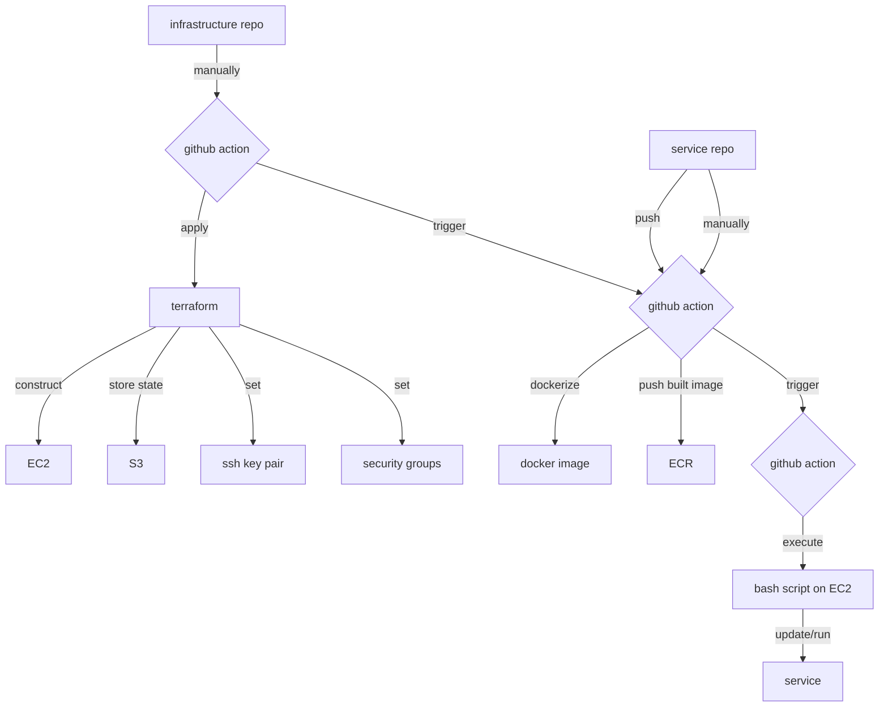
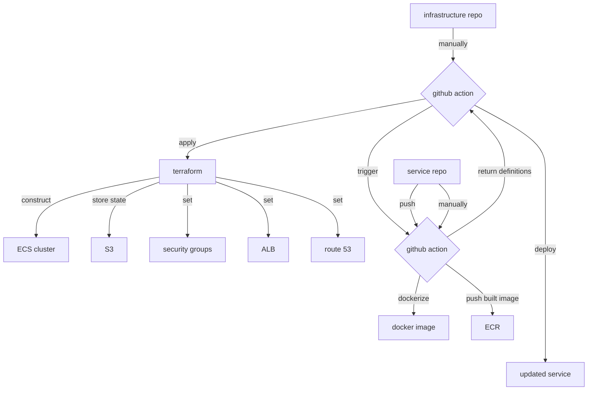

# Resume-Editor-Deployment
# Cloud Deployment Setup Documentation

1) aws ecr create-repository --repository-name resume_modifier_market_backend --region us-east-2
2) aws, terraform, docker installl
3) aws register, create a user
4) create access key for the user
5) aws cli set up
6) cd terraform | ssh-keygen -t rsa -b 2048 -f ./id_rsa
7) terraform init | terraform apply
8) ssh -i id_rsa ec2-user@<your_ec2_ip_address>
9)  touch build.sh | vim build.sh | chmod +x build.sh | ./build.sh

The following demonstrates the sequence diagram for the frontend


### ECS Diagram




### some useful commands

running docker container:

```bash
docker run -d --name market-frontend -p 3000:80 376129840507.dkr.ecr.us-east-2.amazonaws.com/market-frontend:latest
```

aws ecr create-repository --repository-name editor-frontend --region us-east-2


aws logs create-log-group --log-group-name "/ecs/market_backend" --region us-east-2


aws ecs execute-command \
  --cluster resume-editor \
  --task 99cc508bd4304181922816cb6f99e60a \
  --container market-frontend \
  --interactive \
  --command "/bin/bash"


aws ecs update-service \
  --cluster resume-editor \
  --service market-frontend \
  --enable-execute-command


  aws ecs update-service \
  --cluster resume-editor \
  --service market-frontend \
  --task-definition market_frontend_family:32 \
  --enable-execute-command


# how to use act 

need docker installed

# set up
Install via the binary release:

Download the latest release from GitHub:
```bash
wget https://github.com/nektos/act/releases/download/v0.2.71/act_Linux_x86_64.tar.gz

```
Extract and move it to /usr/local/bin:
```bash
tar -xzf act_Linux_x86_64.tar.gz
sudo mv act /usr/local/bin
```

Test the installation:
```bash
act --version
```

# how to use


```bash
cd your_github_repo
```

Ensure the Workflow Files Are in the Correct Directory
GitHub Actions workflows must be located in .github/workflows at the root of your repository. Verify your project structure is as follows:

```project/
  ├── .github/
  │   └── workflows/
  │       ├── push_to_ecr.yml
  │       └── job_market_parser.yml
  ├── Dockerfile.server
  └── other_project_files
```

Ensure that the .secrets file contains valid key-value pairs for the secrets used in your workflow. For example:

```plaintext
AWS_ACCOUNT_ID=your_aws_account_id
AWS_ACCESS_KEY_ID=your_aws_access_key_id
AWS_SECRET_ACCESS_KEY=your_aws_secret_access_key
```

```bash
touch .secrets
act --secret-file .secrets
```

or

If you don’t want to use a .secrets file, you can pass secrets directly via the command line. For example:

```bash
act -s AWS_ACCOUNT_ID=your_aws_account_id -s AWS_ACCESS_KEY_ID=your_aws_access_key_id
```
By default, act runs the push event. To test a specific workflow file (e.g., push_to_ecr.yml):

```bash
act -W push_to_ecr.yml
```

To specify an event (e.g., push):
```bash
act push
```


- [ ] 2024/12/20 Create ECR
- [ ] 2024/12/27 AWS EC2 + Docker Setup (Project 1 frontend + backend)
- [ ] 2025/01/03 GitHub Repo + Dockerfile + GitHub Actions (push image to ECR)
- [ ] 2025/01/10 Setup up GitHub Actions workflow files to push Docker images to ECR
- [ ] 2025/01/17 Pull docker images from ECR and run both frontend and backend in EC2
- [ ] 2025/01/17 Terraform to trigger ECS
- [ ] 2025/01/24 EC2 Automation using Terraform
- [ ] 2025/01/24 Terraform to trigger e2e
- [ ] 2025/01/24 Load balancer
- [ ] 2025/01/31 domain (Godaddy, Namecheap)
- [ ] 2025/02/08 http -> https
- [ ] 2025/02/08 fully e2e deployment on ECS
- [ ] 2025/02/15 Redeploy automation
- [ ] 2025/02/15 integrate Database image
  


