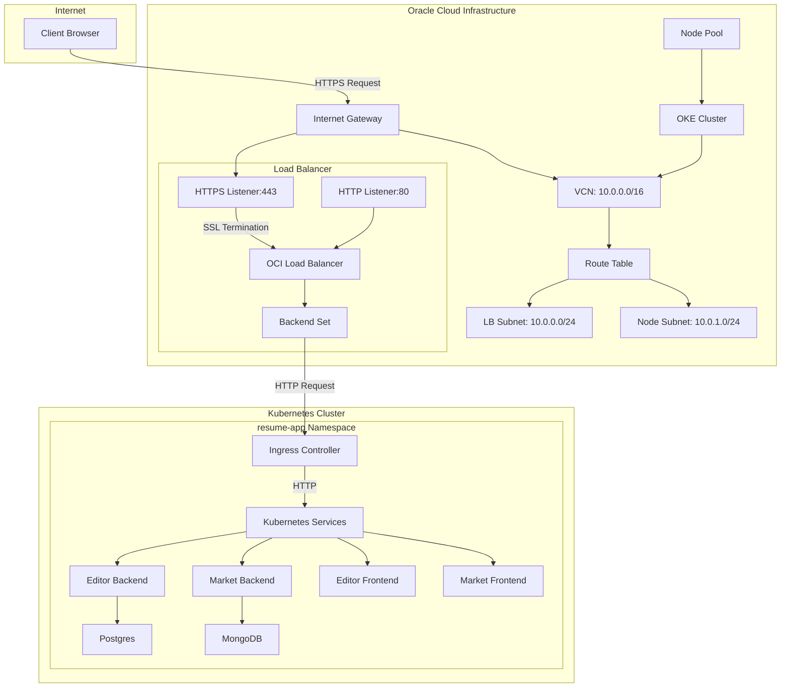
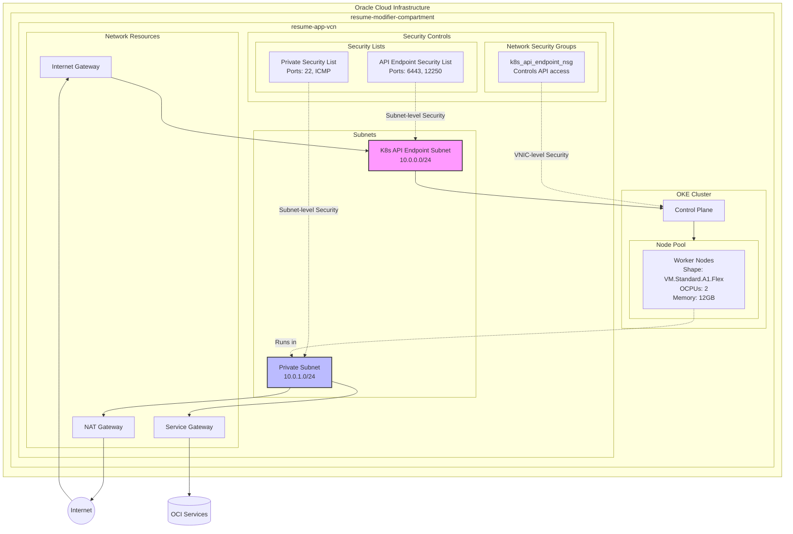
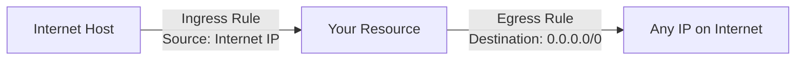
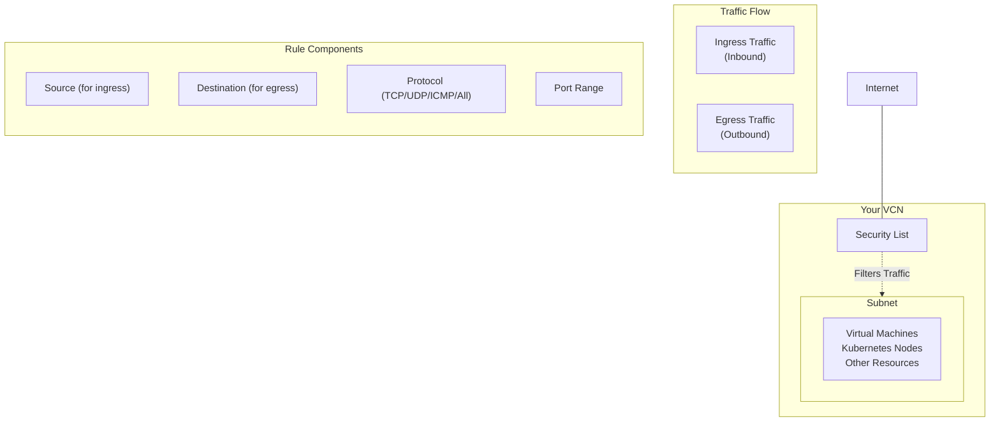
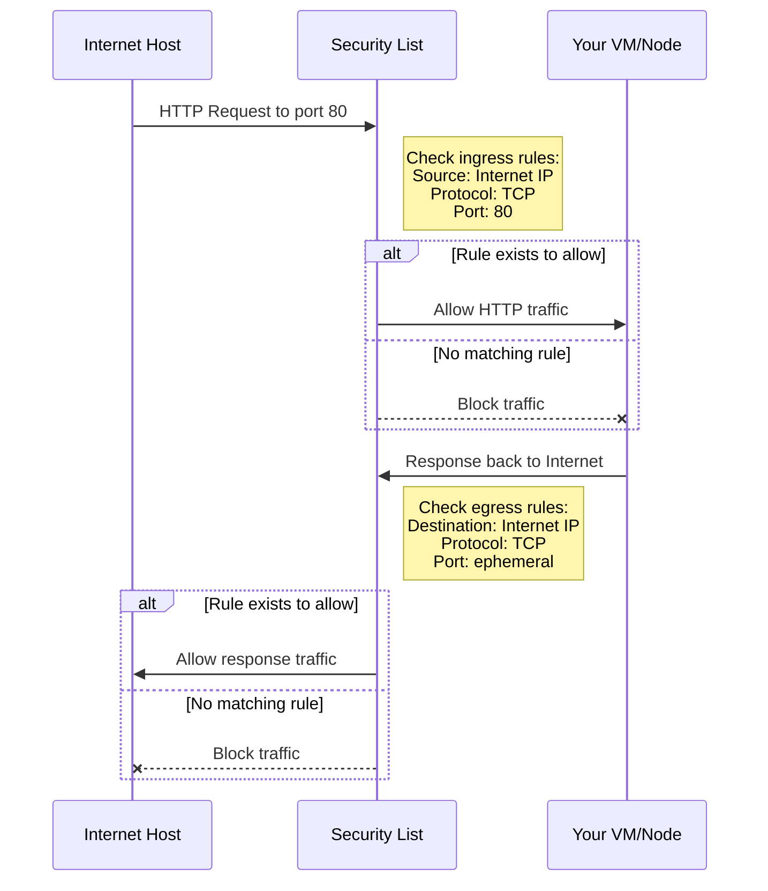
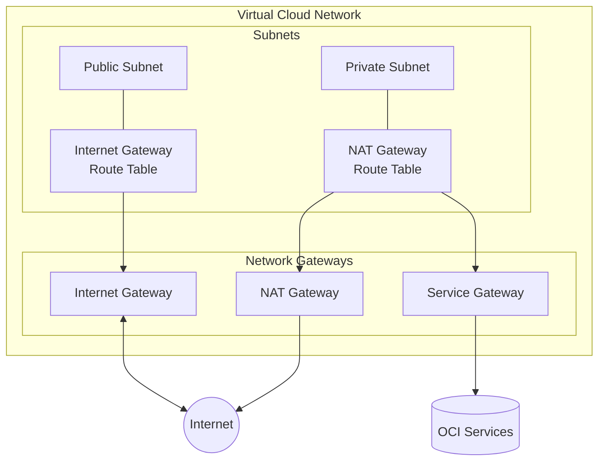

Let me analyze the current load balancer configuration and address your questions about its functionality.

Read file: terraform/loadbalancer.tf
Let me examine the DNS configuration to understand how the domain is set up:

Read file: terraform/dns.tf
Now, let me check the Kubernetes services configuration by examining the deployment YAML files to understand the service setup:

Read file: editor-backend.yaml

Read file: editor-frontend.yaml

Read file: market-backend.yaml

Read file: market-frontend.yaml
Based on the configuration files I've reviewed, I can analyze the current load balancer setup and provide answers to your questions:

### Analysis of the Current Load Balancer Configuration

1. **HTTPS Traffic and SSL Termination:**
   - The load balancer is correctly configured for SSL termination at the load balancer level.
   - HTTPS traffic (port 443) is received by the load balancer, where SSL is terminated.
   - HTTP traffic (port 80) is redirected to HTTPS via a redirect rule set.

2. **Traffic Routing:**
   - The load balancer has path-based routing configured for both HTTP and HTTPS traffic.
   - Paths are properly defined for different services (/api, /api/job_market, /modifier, /).
   - Traffic is routed to the appropriate backend sets.

### Issues and Potential Problems

1. **Hard-coded IP in DNS:**
   - The DNS A record is hard-coded to a specific IP (40.233.115.53), which doesn't match the dynamically assigned load balancer IP.
   - This can cause DNS resolution failures if the load balancer IP changes.

2. **NodePort Configuration Issues:**
   - The load balancer is configured to communicate with NodePorts (31607 for HTTP and 30836 for HTTPS), but there's no clear evidence of ingress or NodePort services in the Kubernetes YAML files.
   - All services are defined as ClusterIP, not NodePort, which means they're not directly accessible from outside the cluster.

3. **Backend Connection Issues:**
   - The load balancer health checks are configured to check "/api", but this path might not exist or might not return 200 for the health checks.
   - There's a mismatch between how the load balancer expects to connect to the services (via NodePorts) and how the services are actually exposed (ClusterIP).

4. **Subnet Configuration:**
   - The load balancer is in the k8s_api_endpoint_subnet, which is correct for public-facing load balancers.
   - However, there's no clear ingress controller or NodePort service to bridge the gap between the load balancer and the ClusterIP services.

### Answers to Your Questions

1. **Does the load balancer route traffic correctly?**
   - The routing configuration (path-based routing) is correct, but there's a gap in how it connects to the Kubernetes services.
   - You need an ingress controller or NodePort services to bridge the gap between the load balancer and your ClusterIP services.

2. **Is the HTTPS certificate working properly?**
   - The certificate configuration looks correct (uses the certificate_ocid from variables).
   - It's set up for TLSv1.2 which is secure.
   - SSL termination should work if the certificate is valid and properly configured in OCI.

3. **Are the services accessible?**
   - Currently, they are likely NOT accessible because:
     - All services are ClusterIP (internal only)
     - There's no ingress controller visible in the configuration
     - The load balancer expects NodePorts but none are defined

4. **Are the services working properly?**
   - The services themselves likely work internally within the cluster.
   - However, they cannot be accessed from outside the cluster without an ingress controller or NodePort services.

5. **Do the subnets configure properly?**
   - The subnet configuration appears to be correct for the VCN and load balancer.
   - However, the way services are exposed needs to be modified to work with this network architecture.

### Recommendation

1. **Deploy an Ingress Controller:**
   - Deploy Traefik or Nginx as an ingress controller with NodePort service type
   - Configure the NodePorts to match what's expected in the load balancer configuration (31607 and 30836)

2. **Or Modify Services to NodePort Type:**
   - Change your services from ClusterIP to NodePort and set the nodePort values to match the expected ports

3. **Fix DNS Configuration:**
   - Update the DNS record to use the dynamically created load balancer IP rather than a hard-coded value
   - Use a Terraform output or data source to get the actual load balancer IP

4. **Adjust Health Check Path:**
   - Ensure the health check path ("/api") is valid and returns HTTP 200
   - Or modify the health check path to one that exists and is reliable

Would you like me to suggest specific modifications to fix these issues?
